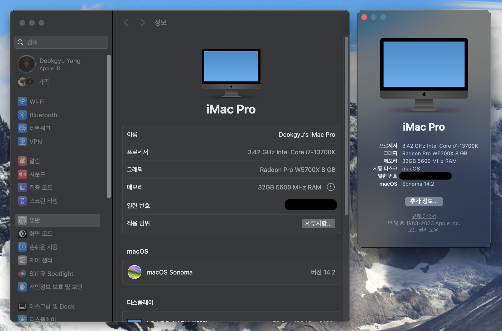
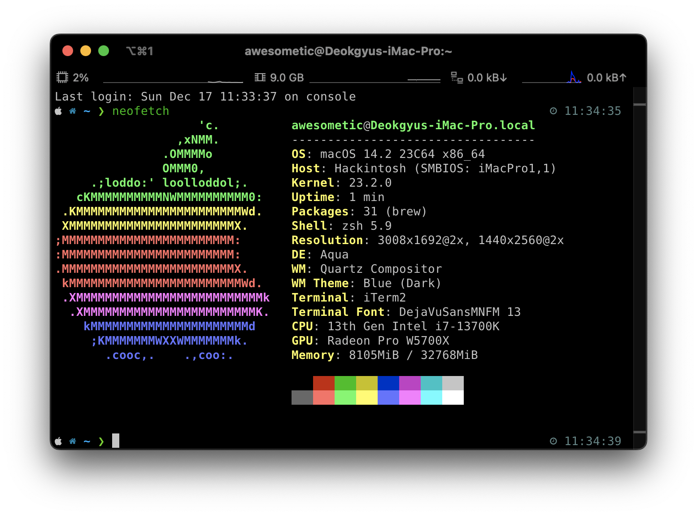
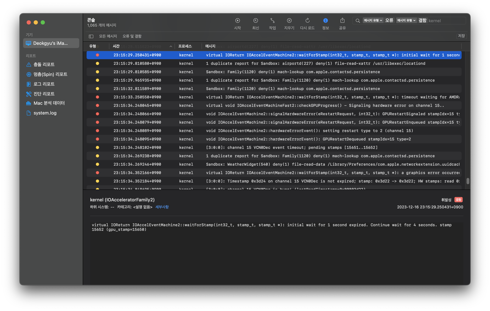

# Raptor Lake Hackintosh EFI

## What is this

This repository contains the EFI directory of Intel RaptorLake i7-13700K and Gigabyte B760M Aorus Elite combo, with somewhat diverse additional components.

## Specification of my computer

| Component    | Product Name                                     | Note                                           |
|--------------|--------------------------------------------------|------------------------------------------------|
| CPU          | Intel 13th Gen Core i7-13700K                    | Undervolting by 0.170 V                        |
| Mainboard    | Gigabyte B760M Aorus Elite                       | F15 BIOS                                       |
| Memory       | Samsung DDR5 5600MHz 16GB 2EA                    |                                                |
| Graphics     | XFX AMD Radeon RX 5700 XT 8GB GDDR6 RAW II Ultra | Changed its thermal pad and thermal paste      |
| NVMe 1       | Samsung 980 PRO 1TB                              | macOS 14 installed                             |
| NVMe 2       | RevuAhn NX2300 1TB                               | KDE neon installed                             |
| SSD 1        | Sandisk Ultra 3D 1TB                             | Windows 11 installed                           |
| BT/WIFI      | Fenvi AXE3000 Pro                                | Intel AX210NGW                                 |
| PSU          | Antec EAG PRO 750W 80PLUS GOLD Modular           |                                                |
| CPU Paste    | Thermalright TFX                                 |                                                |
| CPU Cooler   | DEEPCOOL LS720 ARGB Black                        |                                                |
| MEM Cooler   | LEADCOOL RH-1 EVO ARGB Black                     |                                                |
| Case         | darkFlash DNM600 MAX MESH RGB Black              |                                                |
| USB DAC      | Audinst HUD-DX1 Blue24                           |                                                |
| USB MIC      | Blue Yeti X                                      |                                                |

### Geekbench 6 benchmark results

> Performed only one time right after it boots. The score isn't important for me 🙂

- [CPU](https://browser.geekbench.com/v6/cpu/4013023)
  - Single-core **2784**
  - Multi-core **16459**
- GPU
  - [OpenCL](https://browser.geekbench.com/v6/compute/1451249) **72390**
  - [Metal](https://browser.geekbench.com/v6/compute/1451256) **109462**

## EFI structure

### WARNING

- I recommend you use this as only a reference resource
  - Obviously, this build may not be the best one
  - This EFI contains additional kexts in **config.plist** rather than only the essential things for B760M + RaptorLake CPU. You should remove them before using this on your PC

### Check this before you use

#### Generate your platform information

In the [config.plist](EFI/OC/config.plist) file, I've replaced the private serial codes into the `EDIT_HERE` words because to keep my personal information safe.

So if you are going to use this, you have to make sure that the `EDIT_HERE` texts are changed to yours. To generate the serial key, please refer to the [Dortania's OpenCore Guide](https://dortania.github.io/OpenCore-Install-Guide/AMD/zen.html#platforminfo). When you are about to generate one, you should select `iMacPro1,1` to properly use your machine.

> - If your CPU has less than 8 cores, go to `config.plist` file and find **PlatformInfo->Generic** and change the `ProcessorType` from `3841` to `1537`
> - If you want to change the CPU name, check this link and edit your `config.plist` file using [CPU-Name](https://github.com/corpnewt/CPU-Name)

#### About the Above 4G Decoding option in BIOS

In my setup, I disabled **Above 4G Decoding** in my BIOS and added `npci=0x2000` to the boot args because it doesn't boot with that option enabled.

If you want to use my EFI setup, you have to check whether this option enabled or not, if you want to enable **Above 4G Decoding** then you should remove that `npci=0x2000` arguments from the `boot-args`.

#### Radeon RX 5700 XT gets freezing sometimes

In my system, sometimes it suddenly freezes excepts mouse cursor, and the windows on desktop very stutters annoyingly.

I caught the kernel message when the error comes to occur and I tried everything I could do but couldn't fix it.

Fortunately I found that [there are some other people that suffering from this issue](https://www.reddit.com/r/hackintosh/comments/m1urqd/5700xt_freezing_issue/) too.

> Yes, this issue does exist in [my previous Ryzentosh system](https://github.com/awesometic/hackintosh-gigabyte-x570-aorus-elite) too.

After so many searches I found that some people using Radeon dGPU on their Hackintosh [spoof his GPU to Radeon Pro one](https://www.tonymacx86.com/threads/macos-12-3-update-causes-problems-for-5700-6800-6900-graphics-cards.319421/page-14#post-2312916) by editing `config.plist` file. I gave it a shot, and it seems like working for me too, no kernel panic since I applied this spoofing.

Here is very important caution for those who wants this `config.plist` file with only essential edits. You must check the **GPU PCI path** using [Hackintool](https://github.com/benbaker76/Hackintool) or something, and edit the `DeviceProperties` part of my configs to yours. Otherwise the framebuffer won't init well so you will see only the black screen after boot.

### OpenCore

- Version: 0.9.5

### ACPI

- MaLd0n.aml - Such like AIO method to fix everything including IRQ, PM, RTC, EC, ...
  - [Olarila.com by MaLd0n](https://www.olarila.com/topic/25111-hackintosh-efi-folders-with-opencore-mod/)

### Drivers

- OpenCanopy.efi
- OpenHfsPlus.efi
- OpenRuntime.efi
- ResetNvramEntry.efi

### Kexts

#### Generic kext patcher

> https://github.com/acidanthera/Lilu

- Lilu.kext

#### Improve overall stability and patch CPU name

> https://github.com/acidanthera/RestrictEvents

- RestrictEvents.kext

#### Optimize RaptorLake heterogeneous core configuration

> https://github.com/b00t0x/CpuTopologyRebuild

- CpuTopologyRebuild.kext

#### Apple SMC emulator

> https://github.com/acidanthera/VirtualSMC

- VirtualSMC.kext
- SMCProcessor.kext
- SMCSuperIO.kext

#### Improve NVMe stability

> https://github.com/acidanthera/NVMeFix

- NVMeFix.kext

#### Fix graphics

> https://github.com/acidanthera/WhateverGreen

- WhateverGreen.kext

#### Fix Audio ports

> https://github.com/acidanthera/AppleALC

- AppleALC.kext

#### Fix all USB port works

> https://github.com/daliansky/OS-X-USB-Inject-All

- USBInjectAll.kext
- XHCI-unsupported.kext

#### Fix RTL8125 Ethernet

> https://github.com/Mieze/LucyRTL8125Ethernet

- LucyRTL8125Ethernet.kext

#### Fix WiFi/Bluetooth

> https://github.com/OpenIntelWireless

- Airportltlwm.kext
- BlueToolFixup.kext
- IntelBluetoothFirmware.kext
- IntelBTPatcher.kext

#### Sensor for Radeon GPU

> https://github.com/ChefKissInc/RadeonSensor

- RadeonSensor.kext
- SMCRadeonSensor.kext

### Tools

- OpenShell.efi

## What works and what doesn't work

### Works

- Everything excepts ...

### Doesn't work

- Apple continuity
  - Currently AX210 WiFi supports on macOS is immature yet
  - Sadly, Fenvi T919 (BCM94360) doesn't work on Sonoma
    - Seems like there is workaround but not stable, [check this post](https://www.reddit.com/r/hackintosh/comments/170q5wu/enable_wifi_in_sonoma_with_fenvi_t919/)

## Refer to this as much as you want

But if you want to post your EFI somewhere else, please leave this repository link as a reference.

Thank you :smile:
